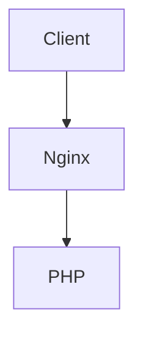

#CloudDisk
>这是我的毕业设计，基于php的在线存储系统，类似于百度网盘的一种东西。

##软件方案:LNMP

###Linux
1.简介
2.安装
3.配置
4.测试
###Nginx
1.简介
2.安装
3.配置
4.测试
###MySql
1.简介
2.安装
3.配置
4.测试
~~~sql
create table users(
	id int primary key not null auto_increment,
    username char(20) not null,
    password char(32) not null
);
~~~
###PHP
1.简介
2.安装
3.配置
4.测试

##软件实现:MVC

- ####MVC
- ####PHPixie
